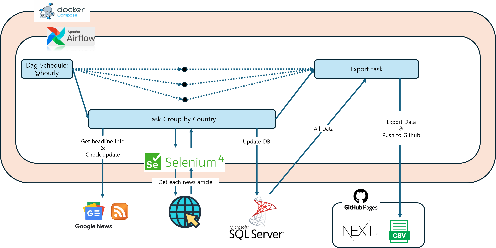

# world-headlines
__world-headlines__ is a service, providing headline news from various countries. 
You can get to the web service [here: world-headlines.vercel.app](https://world-headlines.vercel.app/).  
  
Especially this repository's code does automatic updating process for world-headlines service using apache aiflow. 

## Overview of the updating process
  

- Default scheduling term is a hour
- Google news provides rss news information with url starting like `news.google.com/rss`

## Code map
- `airflow` - contains airflow code
- `airflow/dags/custom` - custom codes (e.g. opertators)
- `airflow/tests` - test codes (`pytest`)
- `sql` - contains SQL queries initializing database

## Country codes
__world-headlines__ service uses country codes to distinguish country dependent information.  
[ISO_3166-1_alpha-2](https://en.wikipedia.org/wiki/ISO_3166-1_alpha-2) provides country identity as 2-characters. This service uses this, but small letters.  


## How to run?
1. Clone [frontend github repository](https://github.com/world-headlines/world-headlines.github.io) and create your github page with it
2. Clone this repository and create `airflow/.env` file like below
```.env
AIRFLOW_IMAGE_NAME=world-headlines-airflow
AIRFLOW_UID=50000
MSSQL_CONN_STR=<your SQL Server connection string for sqlalchemy library>
GITHUB_REPO_CONN_STR=<your github page repository connection string>
```
3. Run `run.sh` or `run.bat` file
