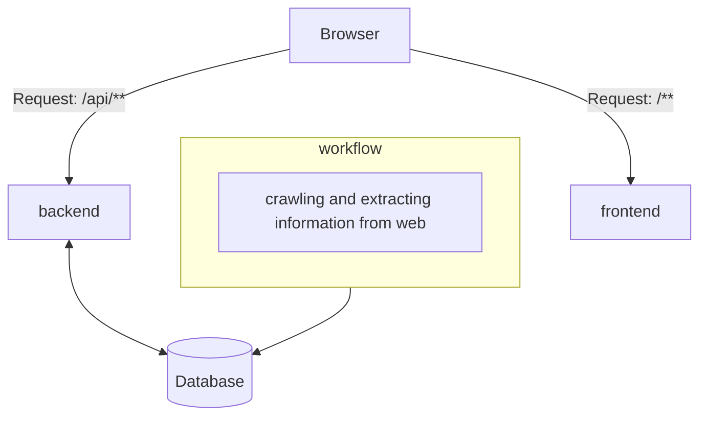

# world-headlines
__world-headlines__ is a service, providing headline news from various countries. 
You can get to the web service [here](https://world-headlines.rst0070.com).  
  
## Overview

This monolithic repository contains following sub-projects:
- `frontend`: React frontend 
- `backend`: Spring Boot RestAPI server
- `workflows`: workflows for news crawling and extracting information leveraging argoworkflows
- `kubernetes`: kubernetes deploy configs including helm chart of backend and frontend services
- Makefiles: for build, push, and deploy process
